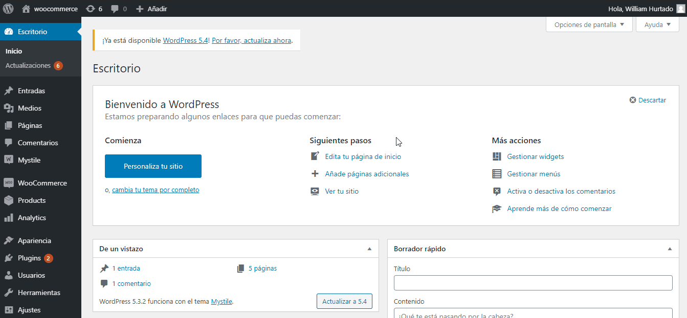
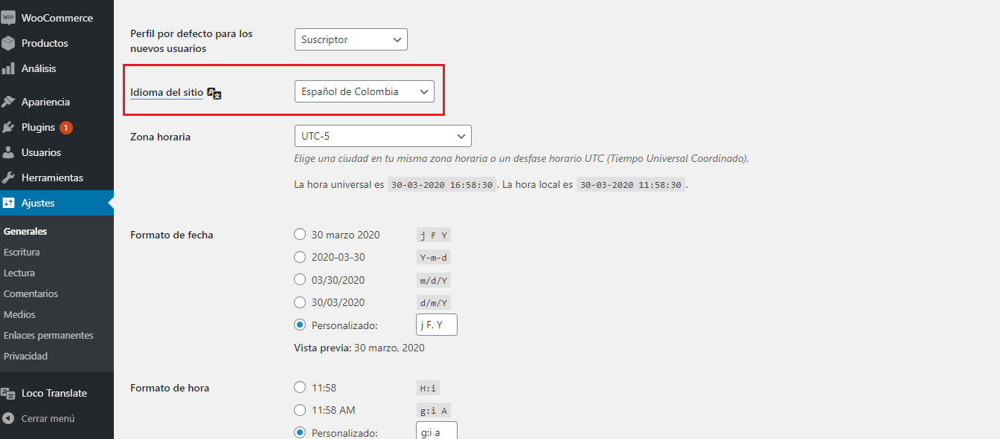

# Woocommerce - Webcheckout - Pago Seguro

## Notas

Se toma la base dada en la documentación de [Woocommerce](https://docs.woocommerce.com/document/payment-gateway-api/) y se adapta las funcionalidades [Webcheckout](http://3.15.12.108:8000/pagoseguro/) de Pago Seguro.

## Pruebas de compras

- En la configuración del módulo habilitar el modo Test en Si
- Buscar generadores de códigos de creditcards.

## Woocommerce 4.0.0

Módulo para pagos en línea por medio de Pago Seguro en modo Webcheckout (se redirige a la pasarela de pagos de Pago Seguro y una vez se procesa el pedido se retorna una respuesta al Woocommerce), este módulo fue desarrollado para Colombia, pero debería funcionar en: (Argentina, Brasil, Chile, Colombia, México, Panamá, Perú)

### Instalación

- Descargar el contenido de este [repositorio](https://github.com/pagosegurorepos/plugin-woocommerce/archive/master.zip), renombra el archivo y la carpeta interna como `pagoseguro`, ingresa al administrador de `Wordpress->Plugins->Añadir Nuevo->Subir plugin`.

- En el administrador de Wordpress ir a la sección de plugins, buscar por "Pago Seguro" y activar.

- Entrar en los ajustes de Woocommerce y en la sección de Pagos, busca Pago Seguro, click en Gestionar e ingresar los datos solicitados.

### Traducciones

Las traducciones del modulo están en Español (Colombia y España) e Ingles (USA), las puedes cambiar al idioma que necesites.

#### Nota

Recuerda que el idioma que quieres actualizar debe estar definido `Ajustes->Generales->Idioma del Sitio`

`Recomendación Tener Instalado el Plugin Loco Translate en tu Wordpress, si es asi sigue estos pasos`

- Vamos a tomar como ejemplo el idioma Español para Perú

