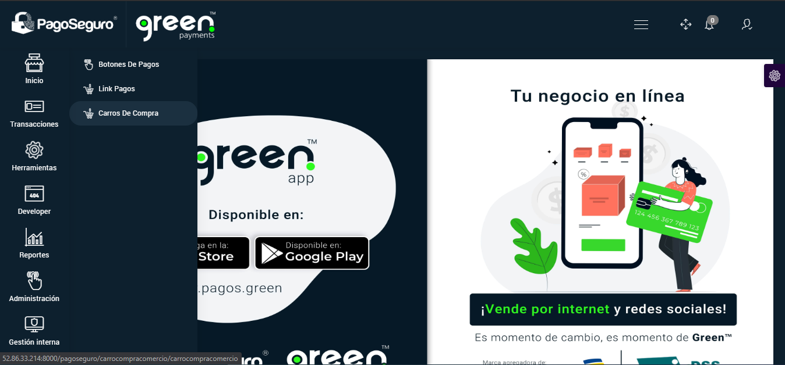
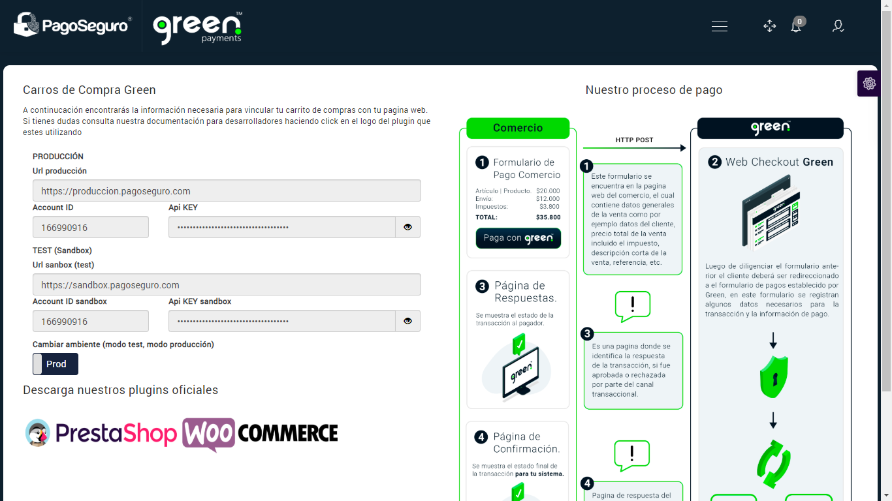
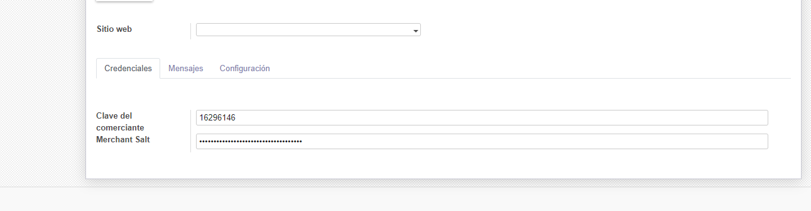

# Integración Webcheckout Pago Seguro

## Formulario de pago

Para realizar conexiones mediante carros de compra o conexión directa (webcheckout) enviando request por POST hacia la plataforma de Pago Seguro, se debe tener el comercio creado y habilitado en la modalidad del servicio carros de compra o webcheckout, con el fin de poder obtener el `Account ID` y el `Api key`.
Dicha información se encuentra en el menú de herramientas, carros de compra tanto para el acceso de pruebas (sandbox) como para el acceso de producción.

Una vez obtenga el `Account ID` y `Api Key` se debe registrar dichos datos en la configuración del plugin de su correspondiente carro de compras o de su sistema, para algunos plugins se debe colocar el campo url response el cual es el url de respuesta una vez una transacción es realizada, en la mayoría de los casos es una vista asociada al comercio:

### Diccionario de datos:

<table>
  <tr>
    <th>CAMPO</th>
    <th>TIPO DE DATO</th>
    <th>TAMAÑO</th>
    <th>DESCRIPCION</th>
    <th>EJEMPLO</th>
  </tr>
  <tr>
    <td>key</td>
    <td>númerico</td>
    <td></td>
    <td>Account ID, se encuentra en la plataforma de Pagos</td>
    <td></td>
  </tr>
    <tr>
        <td>txnid</td>
        <td>texto</td>
        <td>20</td>
        <td>Referencia de compra</td>
        <td>SO0001</td>
    </tr>
    <tr>
        <td>amount</td>
        <td>numérico</td>
        <td>13</td>
        <td>Monto total de la compra</td>
        <td>90.000,00</td>
    </tr>
    <tr>
        <td>productinfo</td>
        <td>texto</td>
        <td>40</td>
        <td>Descripción general de la venta</td>
        <td>Comercio SO0001</td>
    </tr>
    <tr>
        <td>firstname</td>
        <td>texto</td>
        <td>40</td>
        <td>Nombre completo del comprador incluido apellidos</td>
        <td>Jhon Doe</td>
    </tr>
    <tr>
        <td>email</td>
        <td>texto(mail)</td>
        <td></td>
        <td>email del comprador</td>
        <td>jhondow@compra.com</td>
    </tr>
    <tr>
        <td>url_response</td>
        <td>texto</td>
        <td></td>
        <td>Url de respuesta del comercio</td>
        <td>https://www.comercio.com/response</td>
    </tr>
    <tr>
        <td>hash</td>
        <td>texto</td>
        <td></td>
        <td>cadena hash en sha512 el cual concatena los valores (txnid, amount, productinfo, firstname, email)</td>
        <td>hash('sha512', $key . '|' . $txnid . '|' . $amount . '|' . $productinfo . '|' . $firstname . '|' . $email . '|' . '/payment/process||||||||||' . $api_key)</td>
    </tr>
</table>

### Hash

El hash es una cadena de texto la cual se debe enviar mediante método POST junto con la demás información, esta es una cadena de seguridad la cual se debe cifrar mediante sha512 dicha cadena de texto debe cumplir con el siguiente parámetro:

Ejemplo

hash('sha512', $key . '|' . $txnid . '|' . $amount . '|' . $productinfo . '|' . $firstname . '|' . $email . '|' . '/payment/process||||||||||' . \$api_key)

En donde se concatenan las variables generarles de la venta junto con el Api key y el Account ID:

- \$key: Account id del comercio, obtenido desde la plataforma de Pago Seguro Colombia

- \$txnid: Referencia de la compra

- \$amount: Monto total de la compra

- \$productinfo: Descripción general de la venta

- \$firstname: Nombre y apellidos del comprador

- \$email: email del comprador

- \$api_key: Api key del comercio, obtenido desde la plataforma de Pago Seguro Colombia

### Formulario de ejemplo

El siguiente es un formulario de ejemplo para poder realizar un envio de parametros mediante el metodo POST de su sistema:

<textarea id="w3mission" rows="12" cols="102">
<form method="post" action="https://www.sanbox-pagoseguro.com/pagosegurocanal/public/checkoutpay">
        <input type="hidden" name="key" value="16296146" />
        <input type="hidden" name="txnid"  value="SO0001" />
        <input type="hidden" name="amount"  value="75000" />
        <input type="hidden" name="productinfo"  value="Test Pago Seguro" />
        <input type="hidden" name="firstname" value="Test Pago Seguro" />
        <input type="hidden" name="email" value="test@test.com" />
        <input type="hidden" name="hash" value="7ee7cf808ce6a39b17481c54f2c57acc" />
        <input type="hidden" name="udf1" value="/payment/process" />
        <input type="hidden" name="url_response" value="https://www.comercio.response.com" />
</form>
</textarea>

### URL's

URL Producción: https://www.autorizaciones-pagoseguro.com/pagosegurocanal/public/checkoutpay

URL Test (sandbox): https://www.sanbox-pagoseguro.com/pagosegurocanal/public/checkoutpay

## Paginas de respuesta
